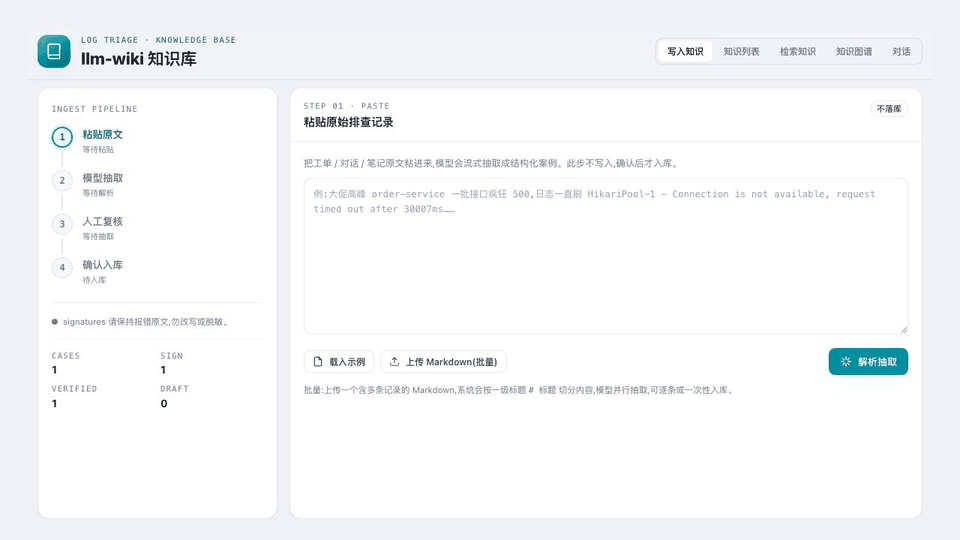
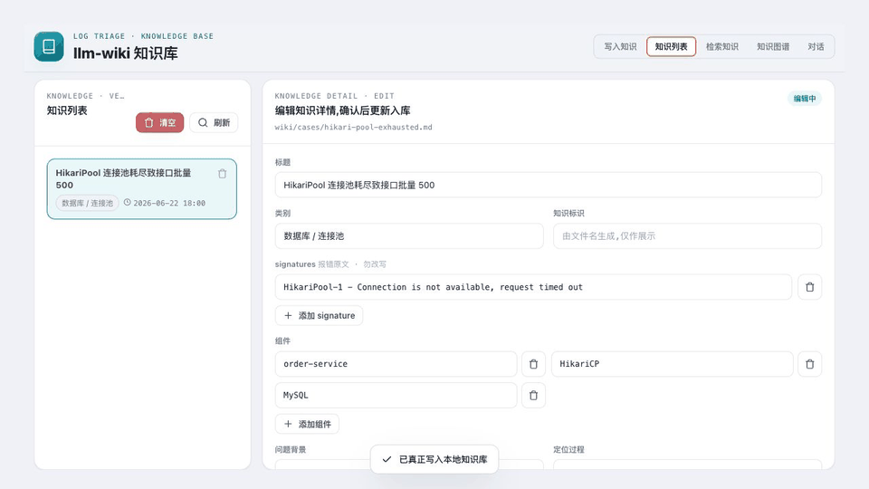
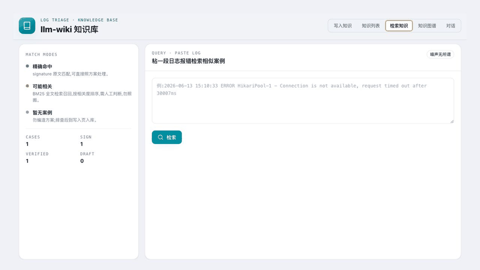
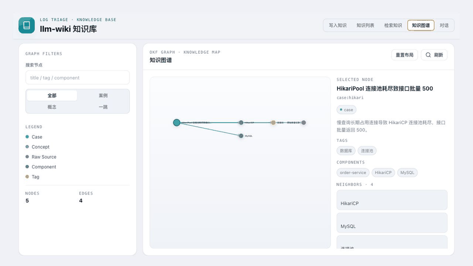
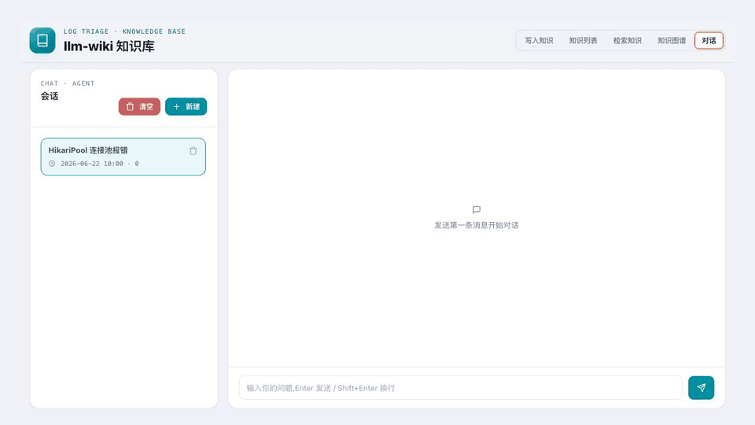

# LLM Wiki

LLM Wiki 是一个面向日志排查、线上故障定位和运维知识沉淀的轻量级知识库与 Web 控制台。它把原始排查记录整理成**可追溯的 Markdown 知识**，用本地检索索引快速命中已复核案例，并提供对话 Agent 在知识库命中时做 RAG 回答、未命中时用大模型兜底。

知识统一按 **Google 的 Open Knowledge Format（OKF）规范** 组织：不可变的原始记录 + 结构化的 wiki 层，每条知识都是带类型化 YAML frontmatter 的 Markdown 文档，章节标准、交叉链接、可渐进式展开，既便于人读，也便于检索、图谱和对话 Agent 使用。

本项目的设计重点不是“自动生成更多内容”，而是“安全地沉淀可信经验”：模型抽取结果必须先预览和复核，原始记录会被归档留痕，检索无命中时明确返回无案例；对话页也会标注答案来源、保留反馈，并暴露检索/模型首字等时延诊断信息。

## 目录

- [功能特性](#功能特性)
- [界面演示](#界面演示)
- [快速开始](#快速开始)
- [配置说明](#配置说明)
- [Web 使用流程](#web-使用流程)
- [知识格式（OKF）](#知识格式open-knowledge-format)
- [API 一览](#api-一览)
- [项目结构](#项目结构)
- [开发与测试](#开发与测试)
- [质量护栏](#质量护栏)
- [安全与隐私](#安全与隐私)
- [贡献指南](#贡献指南)
- [许可证](#许可证)

## 功能特性

- **写入知识**：粘贴原始排查记录或上传 Markdown 批量记录，LLM 流式抽取结构化案例；人工复核后才写入 verified 知识，并把原文归档到 `raw/sources/`。
- **知识列表**：浏览已入库案例，查看入库时间和结构化字段；支持编辑、更新、删除案例，Markdown 始终是权威源。
- **检索知识**：粘贴日志、堆栈或错误码后，先按 `signatures` 精确命中，再用已配置的索引后端模糊召回；默认 SQLite + FTS5，可切换 MySQL FULLTEXT；无命中时明确返回暂无案例。
- **知识图谱**：从 case、concept、tag、component、raw source、正文链接和 shared metadata 构建关系图，辅助查看知识之间的关联。
- **对话 Agent**：先检索知识库，命中高相关案例时做 RAG 回答并标注来源 wiki；未命中时走大模型兜底。每轮只携带本次问题，不自动带入会话历史；页面展示检索耗时、上下文大小、首字耗时，回复支持复制、点赞、点踩。

## 界面演示

| 写入知识 | 知识列表 | 检索知识 |
| --- | --- | --- |
|  |  |  |

| 知识图谱 | 对话 Agent |
| --- | --- |
|  |  |

## 快速开始

**环境要求**

- Python 3.9 或更新版本。
- “写入知识”的 LLM 抽取和“对话 Agent”需要 OpenAI 兼容 API key（两者可配不同模型，见[配置说明](#配置说明)）。
- 检索、列表、编辑已有案例和图谱生成都是本地文件操作，无需联网。

**步骤**

1. 创建虚拟环境并安装：

   ```bash
   python3 -m venv .venv
   source .venv/bin/activate
   pip install -e .            # 运行依赖；开发再装 pip install -e ".[dev]"
   ```

2. 复制配置模板并填写密钥：

   ```bash
   cp config.example.yaml config.yaml
   ```

   最小可用配置：

   ```yaml
   env: "dev"
   openai:
     api_key: "sk-..."
     base_url: "https://api.openai.com/v1"   # 可选：代理 / Azure / 本地兼容网关
     model: "gpt-4o"
   storage:
     backend: "sqlite"   # sqlite | mysql
   ```

   完整字段（`chat` 段、`thinking`、MySQL、环境变量覆盖等）见[配置说明](#配置说明)。

3. 在仓库根目录启动 Web 服务：

   ```bash
   uvicorn --app-dir src llm_wiki.backend.server:app --reload --port 8000
   ```

   浏览器打开 <http://127.0.0.1:8000/>。

知识写入、复核、列表、检索、编辑、删除、图谱查看和对话都在 Web 页面中完成；Python 业务代码统一位于 `src/llm_wiki/`。

## 配置说明

入库管线默认读取仓库根目录的 `config.yaml`，可用环境变量 `INGEST_CONFIG` 指定其它路径。配置文件按 mtime 缓存，改动后无需重启即可生效。

**差异化模型配置**：写入知识用 `openai` 段，对话 Agent 用 `chat` 段。`chat` 以 `openai` 为基底，只需填要改的项（如只换 `model`，密钥和网关自动继承 `openai`）；`chat` 段整段省略时，对话与写入共用同一套配置（向后兼容）。

```yaml
# 写入知识(LLM 抽取)用，也是对话段缺省时的默认基底
openai:
  api_key: "sk-..."
  base_url: "https://api.openai.com/v1"
  model: "gpt-4o"
# 对话 Agent 用(可选)：可与写入用不同的模型 / 网关 / 密钥
chat:
  model: "gpt-4o-mini"
  thinking: true
storage:
  backend: "sqlite"               # sqlite | mysql
  auto_reindex_on_startup: true   # 启动时是否从 wiki/cases/ 整库重建检索索引
```

- `base_url` 可选，用于代理、Azure 或本地 OpenAI 兼容网关；`model` 未配置时默认 `gpt-4o`。
- `chat.thinking` 控制对话模型是否启用 Think/Thinking 模式，默认 `true`；设为 `false` 时会向兼容网关传 `thinking.type=disabled`，通常可减少首字等待。
- `storage.backend` 默认 `sqlite`：检索索引写到 `index/search.db`，对话数据写到 `db/chat.db`。改为 `mysql` 并填写 `storage.mysql` 后，两者都使用 MySQL（SQLAlchemy Core 管理连接池与事务，驱动 `mysql+pymysql`）。
- 环境变量 `LOG_WIKI_STORAGE_BACKEND`、`LOG_WIKI_AUTO_REINDEX_ON_STARTUP`、`LOG_WIKI_MYSQL_*` 可覆盖同名配置。

> **不要提交真实 API key。** 公开仓库只提交 `config.example.yaml`，把 `config.yaml`、私有网关地址和密钥放在本地私有配置中（`config.yaml` 已被 `.gitignore` 忽略）。

## Web 使用流程

### 写入知识

粘贴一段原始排查记录后，后端会流式调用模型抽取结构化 JSON。页面会展示 `title`、`category`、`signatures`、`components`、`background`、`diagnosis`、`solution` 等字段，供用户复核和修改。

预览阶段不会写任何文件；只有点击确认入库后，才会同时写入：

- `raw/sources/`：原始记录，作为不可变溯源材料。
- `wiki/cases/`：已复核的 verified 案例。

批量写入时，上传或粘贴的 Markdown 会按一级标题拆分，每条记录独立抽取、独立展示、独立确认：

```markdown
# 日志 A
...

# 日志 B
...
```

### 知识列表

知识列表展示 `wiki/cases/` 下的 verified 案例，并显示入库时间。可以打开单条知识查看详情、编辑字段、覆盖更新 Markdown，或删除案例文件。删除只移除 `wiki/cases/*.md`，不会删除 `raw/sources/` 中的原始记录。

### 检索知识

粘贴日志、堆栈、错误码或故障现象后，检索流程如下，并展示检索耗时（毫秒）：

1. **精确命中**：如果某个案例的 `signatures` 出现在输入文本中，直接返回命中案例和解决方案。这是检索命门，优先级最高。
2. **模糊候选**：精确命中失败时，用当前配置的索引后端返回可能相关案例。默认是 **SQLite + FTS5（BM25 全文检索、trigram 中文分词）**；切到 MySQL 时使用 **InnoDB FULLTEXT + ngram**。
3. **无命中门控**：没有相关案例时明确返回暂无案例，不编造答案。

检索索引由 `wiki/cases/*.md` 派生（Markdown 始终是权威源），入库/更新/删除时自动同步；服务启动时默认整库重建，可用 `storage.auto_reindex_on_startup: false` 关闭。默认 SQLite 场景下 FTS5 不可用时会自动回退到纯文件扫描，功能不变。索引表结构、查询示例和 MySQL 配置说明见 [db/README.md](db/README.md)。

### 知识图谱

图谱页根据 Markdown frontmatter 和正文链接构建节点与边，展示 case、concept、raw source、tag、component、citation、related link 和相似案例关系。

### 对话 Agent

对话页参考 NextChat 的布局：左侧管理会话（新建 / 切换 / 删除），右侧是与 Agent 的交互。会话会保存历史消息用于回看和反馈统计，但**每次请求大模型时只携带本轮问题**，不会把当前会话的全部历史消息塞进 `messages`。

回答遵循「先检索、后生成」（RAG）：

1. **先检索知识库**：用 `/api/query` 的同一套检索逻辑找相关案例。
   - **精确命中**（signature 原文匹配），或 **模糊命中且关联度足够大**（BM25 相关度 ≥ 阈值 `CHAT_FUZZY_THRESHOLD`，默认 1.0）→ 把命中案例的资料（问题背景 / 定位过程 / 解决方案）**连同自定义提示词一起喂给大模型**，由大模型基于这些资料**流式**生成回答，并标注**来源 wiki**。
2. **检索不到 / 关联度太小** → 不注入知识库资料，直接让大模型基于通用经验**流式**回答，标注为大模型回答。
3. 每条 Agent 回复都能**复制、点赞、点踩**（点踩弹窗要求填写原因）。

两条路径都走 `config.yaml` 里 OpenAI 兼容接口的真流式；区别只在于「是否把检索到的 wiki 资料注入本轮上下文」。命中知识库时的自定义提示词可用环境变量 `CHAT_WIKI_PROMPT` 覆盖，未命中兜底提示词用 `CHAT_SYSTEM_PROMPT`。

> 检索是**可插拔**的：对话编排（`chat/agent.py`）只依赖 LLM 接入层，检索通过 `chat/retriever.py` 的 `Retriever` 接口注入。默认用 `WikiRetriever`（本地知识库 RAG），换成 `NullRetriever` 即为不带检索的纯对话——此时完全不加载检索与入库代码，便于把对话能力单独复用。

对话生成中和生成完成后都会持续展示并落库时延诊断信息：

- **检索耗时**：本地知识库检索花费。
- **上下文大小**：本轮发送给模型的 `messages` 条数和字符数。
- **模型等待耗时**：从开始请求模型到收到第一个模型内容 token 的等待。
- **首字耗时**：从后端开始处理到收到第一个模型内容 token 的耗时。
- **总耗时**：从后端开始处理到 Agent 回复完成并落库的总耗时。
- **模型流细分日志**：后端日志会记录 stream 创建耗时、首个 chunk、首个 content，用于区分本地检索慢、提示词过大、模型网关首包慢或模型首 token 慢。

所有会话、用户提问、Agent 回复、时延指标、点赞 / 点踩（含原因）都会落库。默认写入 `db/chat.db`（运行库，已 gitignore），表结构见 [db/schema.chat.sql](db/schema.chat.sql)；切到 MySQL 时使用 [db/schema.chat.mysql.sql](db/schema.chat.mysql.sql)。这些数据便于后续做对话质量分析、知识盲区发现、性能分析和答案来源统计。

## 知识格式（Open Knowledge Format）

知识严格按 **Google 的 Open Knowledge Format（OKF）规范** 组织。核心约定：

- **类型化 frontmatter**：每条知识用 YAML frontmatter 声明 `id` / `type` / `title` / `tags` / `status` 等元数据。
- **标准章节**：正文用固定的 Markdown 标题分段（问题背景 / 定位过程 / 解决方案 / Citations）。
- **交叉链接与引用**：通过 `sources`、`related` 和正文中的 Markdown 链接建立可追溯的引用关系。
- **渐进式目录**：`wiki/index.md` 自动生成 OKF 风格的渐进式索引，便于人和 agent 逐层展开。

每个 case 是带 YAML frontmatter 的 Markdown 文件：

```markdown
---
id: hikari-pool-timeout
type: Incident Case
title: HikariPool 连接池耗尽致接口批量 500
description: 慢查询长期占用连接，导致连接池耗尽并引发接口 500。
category: 数据库 / 连接池
tags:
  - database
  - hikari
status: verified
confidence: high
signatures:
  - HikariPool-1 - Connection is not available, request timed out
components:
  - order-service
  - HikariCP
  - MySQL
sources:
  - raw/sources/2026-06-16-inc-1234.md
---

## 问题背景
...

## 定位过程
...

## 解决方案
...

## Citations

[1] [原始排查记录](/raw/sources/2026-06-16-inc-1234.md)
```

关键约定：

- `signatures` 必须保留用户最可能粘贴的原始错误文本，不翻译、不改写、不概括。
- `sources` 必须指回对应的 raw 原始记录。
- `status: verified` 表示已复核，可作为回答依据。
- `status: draft` 表示尚未复核，引用时必须标注风险。

## API 一览

前端使用以下 FastAPI 接口：

| 方法     | 路径                           | 说明                                            |
| -------- | ------------------------------ | ----------------------------------------------- |
| `POST`   | `/api/ingest/preview`          | 流式抽取单条记录，仅预览，不落库。              |
| `POST`   | `/api/ingest/preview_batch`    | 按一级标题拆分 Markdown，以 NDJSON 流式返回批量抽取事件。 |
| `POST`   | `/api/ingest/commit`           | 确认写入一条已复核案例（同名 slug 自动追加后缀，不覆盖）。 |
| `POST`   | `/api/ingest/commit_batch`     | 批量确认写入多条案例。                          |
| `GET`    | `/api/knowledge`               | 获取 verified 知识列表。                        |
| `GET`    | `/api/knowledge/{case_file}`   | 获取单条知识详情和原始记录。                    |
| `PUT`    | `/api/knowledge/{case_file}`   | 更新单条知识并刷新索引。                        |
| `DELETE` | `/api/knowledge/{case_file}`   | 删除单条知识，保留 raw 原始记录。               |
| `POST`   | `/api/query`                   | 按日志或报错信息检索知识，返回检索耗时（毫秒）。 |
| `GET`    | `/api/graph`                   | 返回知识图谱节点和边。                          |
| `GET`    | `/api/kb/stats`                | 返回案例数、草稿数、signature 数和更新时间。    |
| `GET`    | `/api/examples/ingest`         | 返回一条示例原始记录和示例结构化案例。          |
| `POST`   | `/api/chat/sessions`           | 新建对话会话。                                  |
| `GET`    | `/api/chat/sessions`           | 列出全部会话（按最近活跃排序）。                |
| `GET`    | `/api/chat/sessions/{id}/messages` | 获取某会话的全部消息（含反馈）。            |
| `DELETE` | `/api/chat/sessions/{id}`      | 删除会话及其消息、反馈。                        |
| `POST`   | `/api/chat/sessions/{id}/messages` | 发送提问，先检索后大模型兜底，NDJSON 流式返回回答。 |
| `POST`   | `/api/chat/messages/{id}/feedback` | 对某条 Agent 回复点赞 / 点踩（点踩需带原因）。 |

接口错误统一返回结构化 `{code, description}`（见 `src/llm_wiki/backend/error_codes.py`）；流式接口出错时只回通用提示与 `request_id`，原始异常仅进日志。

## 项目结构

```text
.
├── LICENSE                    # MIT 许可证
├── config.example.yaml        # OpenAI 兼容接口与存储后端配置模板
├── pyproject.toml             # 包元数据、命令行入口、ruff / pytest 配置
├── requirements.txt           # 指向 pyproject（pip install -e .）
├── .github/workflows/ci.yml   # CI：ruff 静态检查 + pytest（Python 3.9 / 3.12）
├── db/
│   ├── README.md              # 检索索引设计、查询示例与迁移说明
│   ├── schema.chat.sql        # SQLite 对话会话/消息/反馈运行库 schema
│   ├── schema.chat.mysql.sql  # MySQL 对话会话/消息/反馈运行库 schema
│   ├── schema.sqlite.sql      # SQLite/FTS5 检索索引 schema
│   └── schema.mysql.sql       # MySQL/FULLTEXT 检索索引 schema
├── index/                     # 自动生成的 SQLite 检索索引（默认，gitignore，可重建）
├── logs/                      # 本地接口日志与运行日志（gitignore，运行时产生）
├── raw/sources/               # 入库时生成的不可变原始记录（运行时产生）
├── src/llm_wiki/              # 可安装 Python 包（src layout）
│   ├── backend/               # FastAPI 后端、API 路由、静态前端挂载
│   ├── knowledge/             # 入库、检索、图谱与 OKF 检查
│   ├── chat/                  # 对话编排：纯 LLM 生成(agent) + 可注入检索(retriever)
│   ├── search_index/          # 检索索引入口与 SQLite / MySQL 后端
│   ├── chat_store/            # 对话持久化：共享 CRUD 基类 + SQLite / MySQL 方言
│   └── common/                # 路径、LLM 接入(llm)、存储/日志配置、Markdown 案例解析等共享模块
├── frontend/                  # 静态前端，无构建步骤
│   ├── index.html             # 单页应用入口
│   ├── css/styles.css         # 页面样式
│   └── js/                    # 页面模块：写入、批量写入、列表、检索、图谱、对话
├── tests/                     # pytest 用例：检索、Markdown 解析、SQL 切分、chat store
└── wiki/
    ├── cases/                 # 故障案例，signatures 是检索锚点
    ├── concepts/              # 跨案例的通用排查规律
    └── index.md               # 自动生成的 OKF 渐进式目录
```

## 开发与测试

本项目使用 FastAPI 和静态前端，没有前端构建步骤。

```bash
pip install -e ".[dev]"        # 安装含测试 / lint 的开发依赖

# 启动开发服务（自动重载）
uvicorn --app-dir src llm_wiki.backend.server:app --reload --port 8000

# 静态检查与测试
ruff check .
pytest
```

CI（`.github/workflows/ci.yml`）会在 Python 3.9 与 3.12 上运行 `ruff check` 和 `pytest`。测试默认把对话库指向临时文件，不会污染本地 `db/chat.db`。

### 命令行工具

`pyproject.toml` 注册了几个便于排障的入口：

| 命令 | 作用 |
| --- | --- |
| `llm-wiki-ingest <file>` | CLI 入库：抽取并生成 `wiki/cases/_drafts/` 草稿 |
| `llm-wiki-query "报错文本"` | 命令行检索（也支持 `-` 从 stdin 读） |
| `llm-wiki-search [reindex\|search\|stats]` | 检索索引重建 / 查询 / 统计 |
| `llm-wiki-lint-okf` | 校验 wiki 的 OKF 结构与排查护栏 |
| `llm-wiki-chat-store stats` | 查看对话库统计 |

### 日志

Web 服务启动后会自动创建本地 `logs/` 目录并写入：

- `logs/access.log`：接口日志。每个 HTTP 请求都有开始、结束、状态码、耗时、客户端和 `request_id`。
- `logs/app.log`：运行日志。包含启动、检索索引、模型流式调用、对话链路、异常堆栈，以及同一请求生命周期日志。

响应头会返回 `X-Request-ID`，前端或调用方也可以主动传入同名请求头来串联排查。可用 `LOG_WIKI_LOG_DIR=/path/to/logs` 改写日志目录；本地 `logs/` 已被 `.gitignore` 忽略。

## 质量护栏

本项目默认采用保守模式，优先保证排查结论可信。

- **预览后写入**：模型抽取结果不会直接修改知识库。
- **保留原始签名**：`signatures` 是检索命门，不能被改写。
- **原始记录不可变**：每个案例都应能追溯到 raw source。
- **不自动合并案例**：跨案例概念和归纳需要显式复核。
- **不编造解决方案**：无命中就返回无命中，不能根据相似经验伪造答案。

## 安全与隐私

- 原始排查记录可能包含凭证、客户数据、主机名、IP、内部服务名或专有实现细节，公开仓库前请先脱敏。
- 使用 LLM 抽取时，原始记录会发送到 `config.yaml` 中配置的 OpenAI 兼容接口。请根据组织安全要求选择模型提供方、网关和脱敏流程。
- 后端默认未内置鉴权与限流，请仅部署在受信网络内，或在反向代理 / 网关层补充访问控制后再对外暴露。

## 贡献指南

欢迎贡献。适合本项目的改进包括：

- 更安全的写入、复核和回滚流程。
- 在不破坏无命中门控的前提下提升检索质量。
- 更完整的 wiki 健康检查。
- 更清晰、可审计的 Web UI。
- 文档、示例和测试用例。

提交变更前建议：

1. 运行 `ruff check .` 和 `pytest` 全部通过。
2. 确认 `uvicorn --app-dir src llm_wiki.backend.server:app --port 8000` 能正常启动，并通过 Web 页面验证写入、列表、检索和图谱等核心流程。
3. 不提交密钥、私有日志、客户数据或未经脱敏的原始事故记录。
4. 保证新增知识都能追溯到 raw source。

## 许可证

本项目使用 [MIT License](LICENSE) 开源。你可以在遵守 MIT License 条款的前提下自由使用、复制、修改、合并、发布、分发、再许可和销售本项目副本。
